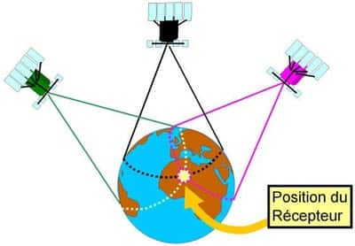
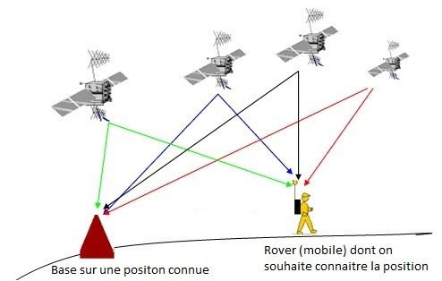

# Explications GPS RTK (réseau centipede)

Le GPS (Global Positioning System) est un système permettant de se localiser avec plus ou moins de précision en utilisant plusieurs satellites pour trianguler sa position. En se référencant uniquement avec les satellites, il est possible d'obtenir une précision de quelques mètres, ce qui est suffisant dans beaucoup de cas.

Cependant, il existe une méthode permettant plus de précision, le RTK, pour Real Time Kinematic.
Le RTK est le dispositif permettant de transmettre en temps réel les données de corrections d’une base d’observation aux GPS mobiles.

Le fonctionnement du RTK repose sur la comparaison des signaux reçus par deux récepteurs GPS : un récepteur de base (base d'observation) et un récepteur mobile.

    Station de base (Base Station) :
        Une station de base est installée à un emplacement dont les coordonnées sont précisément connues (souvent mesurées avec une grande précision à l'aide d'instruments de levé terrestre).
        La station de base reçoit en continu les signaux des satellites GNSS et mesure les erreurs dans les signaux, notamment les erreurs dues à l'atmosphère et à l'horloge des satellites.

    Récepteur mobile:
        Le récepteur mobile est utilisé sur le terrain pour déterminer sa propre position.
        Le rover reçoit également les signaux des satellites GNSS, mais il ne dispose pas des informations précises sur les erreurs dans ces signaux.

    Correction en temps réel :
        La station de base envoie les données de correction en temps réel au rover. Ces données de correction contiennent des informations sur les erreurs dans les signaux GNSS (par exemple, les erreurs dues à l'atmosphère) qui ont été mesurées par la station de base.
        Le rover utilise ces corrections pour corriger les mesures qu'il reçoit des satellites GNSS en temps réel.

    Calcul de la position précise :
        Le récepteur mobile utilise les signaux corrigés pour calculer sa position en temps réel avec une précision élevée, généralement de l'ordre du centimètre.