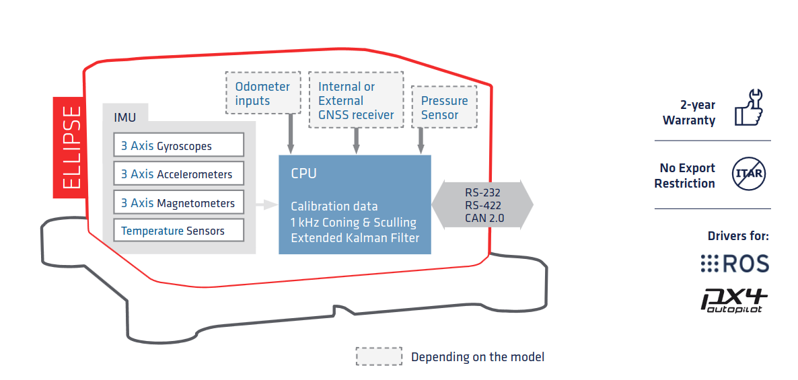

# Notes sur les SBG Ellipse-E et SBG Ellipse-D

Deux types d'IMU pour ce projet qui viennet de chez SBG. Un SDK (coucou Théo) est fourni avec les capteurs.

### SBG Ellipse-E pour le dock

L'[_Ellipse-E_](https://www.sbg-systems.com/fr/produits/ellipse-series/#ellipse-e_miniature-ins) est un capteur inertiel de navigation miniature polyvalent qui se connecte à tout récepteur GNSS de classe industrielle pour fournir des données de navigation, mais également à d'autres capteurs tels qu'un DVL ou un odomètre.

Il est particulièrement adapté si vous souhaitez intégrer un modèle GNSS en particulier ou en cas d'intégration très poussée. Il  fournit le roulis, tangage, le pilonnement, le cap magnétique ou GNSS fournie par le récepteur interne, ainsi que la position.

### SBG Ellipse-D pour le drône

L'[_Ellipse-D_](https://www.sbg-systems.com/fr/produits/ellipse-series/#ellipse-d_rtk_gnss_ins) est la plus petite centrale inertielle de navigation intégrant un récepteur GNSS bi-fréquence, double antenne et capable de fournir un cap précis ainsi qu'une position centimétrique dans les conditions GNSS les plus difficiles.

Il fournit orientation, cap, pilonnement ainsi que des sorties de navigation.

### Datasheet

