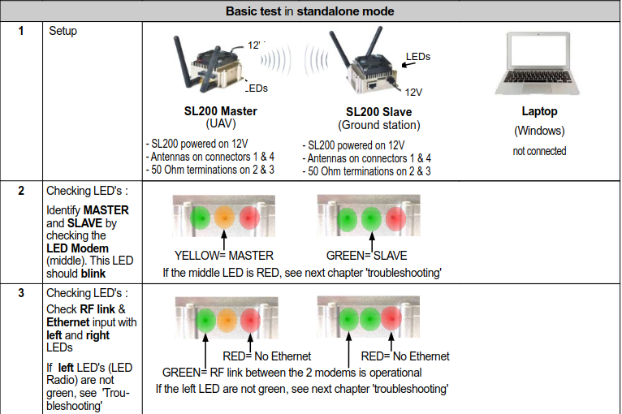
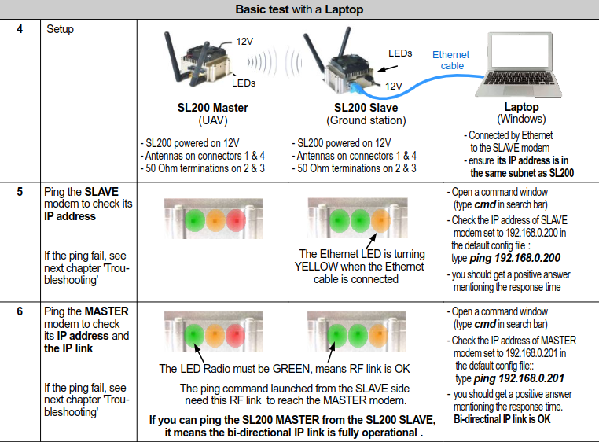

# Résumé de la documentation de Simpulse

- Les deux modems sont normalement pré-configurés pour que l'un d'entre eux soit le "master" et l'autre le "slave".

- Le test de connexion des deux modems se fait en deux parties:
    1. On commence par allumer les deux modems tout seuls, et on vérifie les LEDS
    
    2. On teste ensuite la connexion avec un ping à l'aide d'un PC connecté en ethernet à l'un des deux modems:
    

IP du dock : 192.168.0.12

